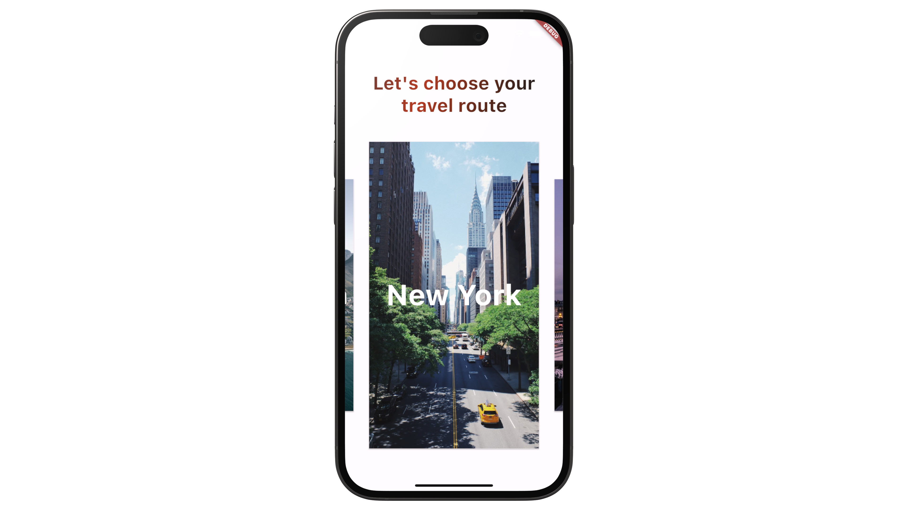
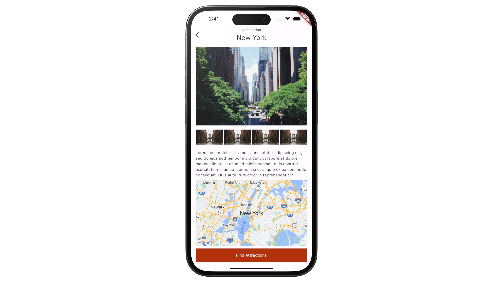
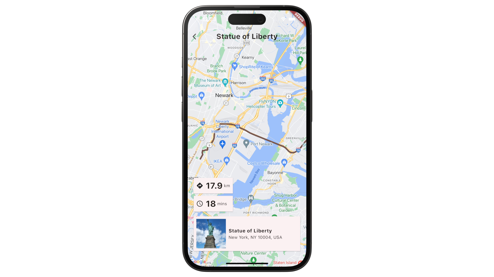

# Travel Routes App with Flutter and Google Maps

The Travel Routes Flutter app integrates with Google Maps Platform using 'google_maps_flutter'. It offers users details on travel locations, points of interest, and efficient routing. Real-time geolocation is facilitated through the 'geolocator' package and Google's Geocoding API, which converts coordinates into user-friendly addresses.

The app is connected with three main APIs:
* The Places API provides detailed insights into locations, including photos and operating hours.
* The Routes API offers precise navigation directions.
* The Geocoding API translates between geographical coordinates and addresses.

State management is handled with Riverpod. The UI is animated with 'flutter_animate' library. 

## App Screenshots: 
|  |  |
|:---:|:---:|
| Home Screen with City Selection | Destination Screen with City Information | 
|  |  |
| Points of Interest Screen | Map Screen with Navigation Details |

## Features: 
* Flutter app integrates with:
  * Google Maps using the `google_maps_flutter` library.
  * Enables geolocation services with the `geolocator` package.
  * Supports geocoding using the Geocoding API from Google Maps Platform (e.g., converts coordinates to addresses).
* API client to connect with:
  * Places API --> Get places information from photos and addresses to opening hours
  * Routes API --> Get directions from place A to place B and more. 
  * Geocoding API --> Convert coordinates to addresses and vice versa.
* The app uses Riverpod as a state management solution with the state stored and update through providers and notifiers.
* The UI is enhanced with animations using the flutter_animate library. 

## Prerequisites
Before you start, make sure you have the following:
* Flutter 3.10 (or newer) and Dart 3.0 (or newer version)
* [Google Cloud Platform account](https://console.cloud.google.com/)
